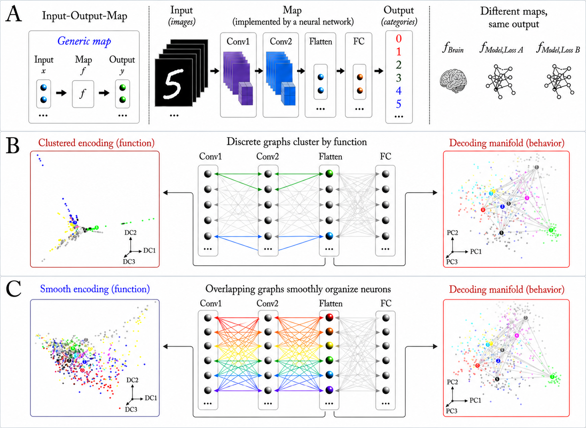

# Decoding Alignment without Encoding Alignment

*Code for anonymous NeurIPS submission.*

> **Interactive demo:** [Neural Manifold Explorer](https://jwv5cpcptb-afk.github.io/Neural_Manifold_Explorer/)

---

Decoding approaches such as RSA, CKA, and classification accuracy are widely used to compare neural systems across brain regions, organisms, and deep learning models. This paper demonstrates a fundamental limitation: **the same decoding score can be achieved by a tiny, non-representative subpopulation of neurons**, and alignment metrics are blind to the internal functional organization that distinguishes biological systems from one another.

We address this using the complementary **encoding manifold**: rather than representing stimuli as points in neural-response space (decoding), the encoding manifold represents *neurons* as points in stimulus-response space. Its global topology — discrete clusters in retina, continuous in V1 — directly reflects functional architecture independently of any downstream readout.



**(A)** A neural network as an input-output map — different internal maps can produce the same behavior. **(B)** Stimuli in neural coordinates (decoding manifold, right) vs. neurons in stimulus coordinates (encoding manifold, left). **(C)** Similar decoding topology can arise from qualitatively different encoding topology, as demonstrated in a controlled MNIST experiment.

Across mouse retina, V1, five Allen Brain Observatory cortical areas, and several deep learning models, we show that (i) decoding metrics saturate near ceiling with as few as 5% of neurons under information-maximizing selection, and (ii) continuous vs. clustered encoding topologies are indistinguishable by RSA, CKA, or DSA — yet are causally distinct and biologically meaningful.

---

## Quickstart — reproducing paper figures

**`notebooks/13_paper_figures.ipynb`** is the primary notebook. It generates all main paper figures and requires pre-computed intermediate data described below.

### What notebook 13 needs

| Input | Generated by | Notes |
|-------|-------------|-------|
| `data/sampled/tensor4d_*.npy` | Notebooks 01–05 | Layer activations, shape `(N × S × K × T)` |
| `data/decompositions/*.mat` | MATLAB step | CP decomposition factors |
| `data/graphs/*.npz` | Notebook 06 | IAN adjacency graphs |
| `data/metrics/*.json` | Notebook 06 | Precomputed graph statistics |
| `stimuli/flowstims/` | Tracked in repo | Optical-flow stimuli |

If you only want to regenerate figures from cached data, obtain the intermediate files (see Data section below) and run notebook 13 directly.

---

## Installation

```bash
pip install -r requirements.txt
pip install git+https://github.com/cajal/fnn.git          # FNN model
pip install git+https://github.com/dyballa/IAN.git         # IAN graphs
```

For Flyvision analysis (`02_sample_flyvis.ipynb`) also install:
```bash
pip install git+https://github.com/TuragaLab/flyvis.git
```

MATLAB with the [Tensor Toolbox](https://www.tensortoolbox.org/) is required for the CP decomposition step between notebooks 01–05 and notebook 06.

---

## Full pipeline

Run notebooks in order only if you need to regenerate intermediate data from scratch.

### 1 — Sample activations (notebooks 01–05)

Each notebook captures layer activations for optical-flow stimuli and saves `tensor4d_<PREFIX>.npy` (shape: `neurons × stimuli × directions × time`) to `data/sampled/`.

| Notebook | Model |
|----------|-------|
| `01_sample_fnn.ipynb` | FNN / ResNet |
| `02_sample_flyvis.ipynb` | Flyvision (fly visual system) |
| `03_sample_mousenet.ipynb` | MouseNet (mouse connectome CNN) |
| `04_sample_r2plus1d.ipynb` | R(2+1)D-18 (video CNN) |
| `05_sample_cornet.ipynb` | CORnet-S (primate visual cortex) |

### 2 — Tensor decomposition (MATLAB)

```matlab
% Copy .m files into your tensor_toolbox directory first (see matlab/README.md)
run_permcp('tensor_filename', 'shift', F, max_iters, num_reps, num_workers)
% e.g.: run_permcp('fnn07_act_...', 'shift', 15, 50, 30, 8)
```

Outputs `.mat` files to `data/decompositions/`.

### 3 — Encoding manifolds (notebook 06)

Builds IAN graphs, computes graph statistics and MDS embeddings.  
Outputs to `data/graphs/` and `data/metrics/`.

### 4 — Paper figures (notebook 13) ← start here if caches are available

Generates all main paper figures using the above intermediate data.

---

## Other notebooks

| Notebook | Purpose |
|----------|---------|
| `07_encoding_manifolds_raptor.ipynb` | Encoding manifolds for the Raptor dataset |
| `08_decoding_analysis.ipynb` | PCA decoding manifolds and trajectories |
| `09_natural_video.ipynb` | Natural movie analysis (Allen Brain Observatory) |
| `10_encoding_decoding_explorer.ipynb` | Interactive 3-D ManifoldExplorer |
| `11_additional_figures.ipynb` | Supplementary figures |
| `12_mnist_cnn_manifolds.ipynb` | Controlled MNIST experiment |

---

## Repository structure

```
.
├── notebooks/          # 01–13, run in order (see pipeline above)
├── src/                # Shared Python utilities
│   ├── subpop_utils.py      # Subpopulation selection and decoding metrics
│   ├── tensor_utils.py      # CP decomposition loading and tensor ops
│   ├── graph_utils.py       # IAN graph statistics
│   ├── manifold_utils.py    # MDS embedding, HDBSCAN clustering
│   ├── metrics.py           # GW/GH distances, OSI, index maps
│   ├── tubes_utils.py       # S_tight / S_cross tubularity
│   ├── explorer_utils.py    # ManifoldExplorer 3-D widget
│   └── ...
├── matlab/             # Permuted nonneg. CP decomposition scripts
├── stimuli/flowstims/  # Optical-flow stimulus images (tracked in repo)
├── img/                # Figures for README (add DecOverview.png here)
└── data/               # Gitignored — generated by the pipeline
    ├── sampled/        # tensor4d_*.npy
    ├── decompositions/ # MATLAB CP factors (*.mat)
    ├── graphs/         # IAN adjacency matrices (*.npz)
    └── metrics/        # Graph statistics (*.json)
```
